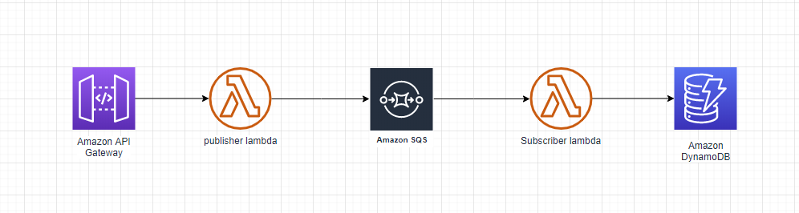

A simple project:
 - ApiGateway connected to lambda function (publisher)
 - publisher lambda that generates random number and saves messages to sqs queue
 - consumer lambda that saves those messages to dynamoDb

 